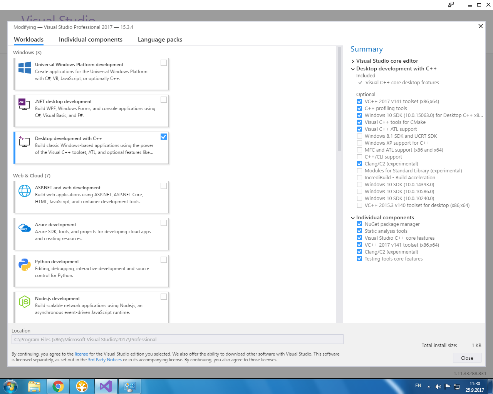

<!-- @format -->
<h1 align="center">
   BPC-ALD 
</h1>

## 1.CV (TVector)

- Prázdný projekt - (https://github.com/peoblouk/BPC-ALD/archive/139065b91894c760631c64bd2558fc8627cf8a95.zip)

## 2.CV (TStack_array, TStack_list)

- umět vysvětlit práci funkci pop, push, top
- Prázdný projekt - ()

## 3. CV (TQueue_list)

- Prázdný projekt - ()

## Visual Studio settings
 - 
