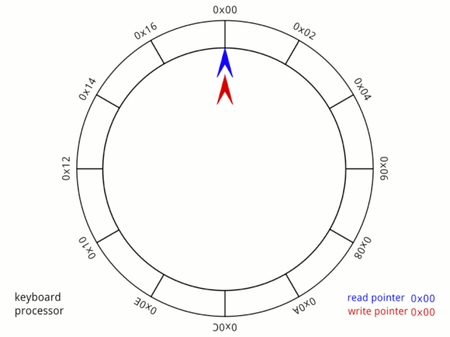

<!-- @format -->
<h1 align="center">
   BPC-ALD 
</h1>

<b>Slovník</b>
- Iterátor - slouží obečně pro iterování v nějakém souboru dat (neboli procházení třeba jednotlivých složkách seznamu
- ADT - alternativní datový typ
- časová Amortizace - znamená, že když dojde k naplnění například pole, tak se dopředu naalokuje 2x více paměti, naopak při odstraňování když klesne na 75% kapacity, tak se pole uvolní
----------------------------------------------
## TVector

- Typ Vector spravuje dynamicky alokované pole prvků typu VectorElement a umožňuje s nimi pracovat pomocí definovaného API
  
- <b>POZOR !!! Pokud jsem změnil typ TVectorElement z int na char musím najít makro #define TVECTOR_ELEMENT_FRMSTR   "%d" </b>

```
struct TVector
	{
	TVectorElement *iValues;	///< Ukazatel na počáteční prvek pole hodnot typu VectorElement
	size_t iSize;	           	///< Počet elementů vektoru
	};
struct TVectorIterator
	{
	struct TVector *iVector;	///< Ukazatel na navázaný vektor (mutable iterátor - umožňuje měnit elementy VectorElement)
	size_t iPos;			///< Aktuální pozice pro indexaci elementu v navázaném vektoru
	};
```


----------------------------------------------
## TStack_array a TStack_list (LIFO - zásobník)

- umět vysvětlit práci funkci pop, push, top


<b>TStack_array (LIFO realizováno pomocí pole) </b>
```
typedef int TStackElement;					///< Definice typu StackElement (datový typ elementů zásobníku
#define STACK_MAXCOUNT 1024					///< Maximální počet elementů zásobníku

struct TStack
	{
	size_t iCount;						///< Aktuální počet elementů zásobníku
	TStackElement iValues[STACK_MAXCOUNT];			///< Pole hodnot typu StackElement
	};
struct TStackIterator
	{
	const struct TStack *iStack;	///< Ukazatel na navázaný zásobník (immutable iterátor - neumožňuje měnit elementy StackElement)
	size_t iPos;					///< Aktuální pozice pro indexaci elementu v navázaném zásobníku
	};
```
----------------------------------------------

<b>TStack_list (LIFO realizováno seznamu)</b>
```
typedef int TStackElement;					///< Definice typu StackElement (datový typ elementů zásobníku)
struct TStack
	{
	struct TStackNode *iTop;				///< PIMPL ukazatel na počáteční uzel lineárního jednosměrně vázaného seznamu obsahujícího elementy zásobníku (Pointer to private IMPLementation)
	};
struct TStackNode
	{
	struct TStackNode *iNext;				///< Ukazatel na následující uzel lineárního jednosměrně vázaného seznamu
	TStackElement iValue;					///< Element zásobníku uložený v uzlu lineárního jednosměrně vázaného seznamu
	};
```


----------------------------------------------
## TQueue_list (FIFO - fronta)
- Typ Queue obsahuje ukazatele na dynamicky alokované proměnné typu QueueNode, které představují uzly s hodnotami elementů uspořádanými do lineárního jednosměrně vázaného seznamu


```
typedef int TQueueElement;					///< Definice typu QueueElement (datový typ elementů fronty) // Mohu změnit aby elementy byli například typu float
struct TQueue
	{
	struct TQueueNode *iFront;				///< PIMPL ukazatel na první uzel lineárního jednosměrně vázaného seznamu realizujícího frontu
	struct TQueueNode *iBack;				///< PIMPL ukazatel na poslední uzel lineárního jednosměrně vázaného seznamu realizujícího frontu
	};
```

----------------------------------------------
## TQueue_circle (FIFO - fronta)

- promměnná iBackPos ukazuje na první volné místo v kruhu !


```
typedef int TQueueElement;						///< Definice typu QueueElement (datový typ elementů fronty)
#define QUEUE_MAXCOUNT 1024						///< Maximální počet elementů fronty
struct TQueue
	{
	size_t iFrontPos;						///< Aktuální index prvku pole určeného pro odstranění elementu z čela fronty
	size_t iBackPos;						///< Aktuální index prvku pole určeného pro vložení elementu na konec fronty
	TQueueElement iValues[QUEUE_MAXCOUNT];				///< Pole hodnot typu QueueElement
	};
struct TQueueIterator
	{
	const struct TQueue *iQueue;					///< Ukazatel na navázanou frontu (mutable iterátor - umožňuje měnit elementy QueueElement)
	size_t iPos;							///< Aktuální pozice pro indexaci elementu v navázané frontě
	};
```


## Příklady užitečných funkcí, které stojí za využití:
<b>Tisk elementů pomocí iterátoru, dá se využít všude </b>
- <b>print_element </b>

<b>Funkce projede pomocí iterátoru všechny elementy a vytiskne je </b>
- <b>př: queue_for_each(queue_iterator_begin(&queue1), print_element); <b> 

<b>Vyhledá první element fronty splňující zadaný predikát aPredicate. Vyhledávání probíhá od elementu určeného iterátorem aIter, až do konce fronty. </b>
- <b>př: struct TQueueIterator it = queue_find_if(queue_iterator_begin(&queue1), is_element_with_value_43); </b>

<b>Vyhledá první element fronty nesplňující zadaný predikát aPredicate. Vyhledávání probíhá od elementu určeného iterátorem aIter, až do konce fronty. </b>
- <b>př: struct TQueueIterator it = queue_find_if_not(queue_iterator_begin(&queue1), is_element_with_value_43); </b>

<b> Přetypování </b>
 Zajišťuje, že i když calloc standardně vrací ukazatel na void, tedy void*, tento výsledek bude interpretován jako ukazatel na TStackElement, což je pravděpodobně datový typ, který má být použit ve vašem zásobníku. Tento "typecast" je užitečný, protože vám umožňuje přiřadit výsledek přímo do proměnné očekávaného typu, aniž byste museli použít explicitní přetypování.
 
 - (TStackElement*)
<b>Oboustranná fronta </b>
- Pokud chci oboustrannou frontu musím realizovat další dvě operace, mám tak:
	- push (na konec fronty) , pop (vyhodit ze začátku fronty), pop_back (vyhodit z konce fronty), push_front (přidat na začátek fronty)
  
```
bool queue_push_front(struct TQueue* aQueue, TQueueElement aValue) // Vložení prvku na začátek
	{
	if (aQueue == NULL)
		return false;
	if (queue_is_empty(aQueue) == false)
		return false;

	if (--aQueue->iFrontPos < 0) // Index je záporný v C nelze
		{
		aQueue->iFrontPos = QUEUE_MAXCOUNT + aQueue->iFrontPos; // 1024 + (-1)
		}
	else // Index
		aQueue->iFrontPos = --aQueue->iFrontPos;

	aQueue->iValues[aQueue->iFrontPos] = aValue;

	return true;
	}
```

```
bool queue_pop_back(struct TQueue* aQueue) // Odebrání prvku z konce
	{
	if (aQueue == NULL)
		return false;
	if (queue_is_empty(aQueue) == false)
		return false;

	if (aQueue->iBackPos == 0) // Pokud se dostanu na konec seznamu
		{
		if (aQueue->iFrontPos == QUEUE_MAXCOUNT - 1) // Ověřuji zda není pole plné
			return false;
		return aQueue->iBackPos = QUEUE_MAXCOUNT - 1;
		}

	if (aQueue->iBackPos == aQueue->iFrontPos) // Pole je plné nebo prázdné
		return false;
	
	aQueue->iBackPos -= 1;
	return true;
	}
```


